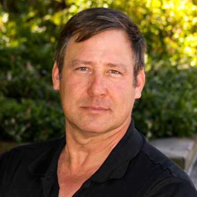

<!-- SHARED INCLUDE: an "About jstats" section (package) followed by an
     "About the developer" section (bio + photo). Pulled into index.qmd (public
     welcome) and griffith.qmd (course front door) via
     . Edit once here; both pages update. The
     .jbio styling lives in custom.scss (global); the photo floats right beside
     the bio paragraph. The leading underscore keeps Quarto from rendering this
     as a standalone page. American English (the Griffith-specific sections on
     griffith.qmd stay Australian; this shared block is American on both). -->

```{=html}
<div class="jbio">
  <h2 class="jbio-name">About jstats</h2>
  <p>jstats makes statistical analysis in R approachable for social-science researchers and students. R is powerful, but its learning curve and rough edges can make the move from commercial statistical software like SPSS, Stata, or SAS intimidating. jstats smooths that path: shorter, more consistent syntax; sensible defaults; protection from some of base R's more confusing behaviors; and output styled after the conventions the expensive commercial platforms use, so results look familiar from the first run.</p>
  <p>It stays close enough to base R that the skills you build transfer to the wider R world rather than locking you into a private dialect. jstats grew out of teaching statistics to social-science students who wanted to learn the methods, but not complex computer programming, and it's continuously being shaped by what students and colleagues run into when they put it to work.</p>
  <h2 class="jbio-name" style="margin-top: 1.75rem;">About the developer</h2>
  <div class="jbio-photo">
    
  </div>
  <p>I'm Jeff Ackerman, a social scientist who teaches quantitative methods at Griffith University in Queensland, Australia. I grew up in Pennsylvania, in the United States, and joined Griffith in 2013; I'm now an Australian citizen. I studied statistics and research methods at the Pennsylvania State University under several well-known methodologists, including C. R. Rao &mdash; himself a student of Ronald Fisher, the statistician who developed Analysis of Variance (ANOVA). Alongside statistics, I trained in computer programming at the university level decades ago, and that combination &mdash; now paired with modern AI-assisted software engineering and careful testing &mdash; is what makes it practical for one person to build and maintain a package this size.</p>
</div>
```
