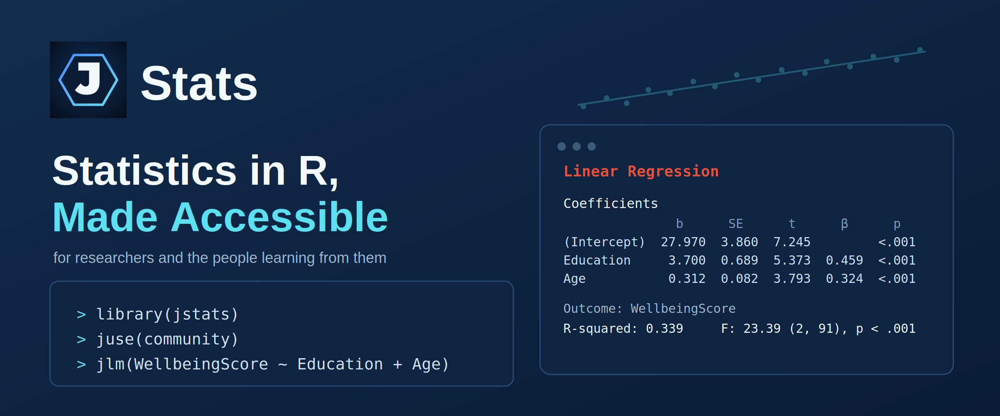

<!--
::: {.column-page}
{fig-alt="JStats — Statistics in R, Made Accessible"}
:::
-->

::: {.callout-warning title="Demo draft v1"}
This is an early cut for colleague review. Some pages are complete and others are
still skeletons. The labeled side-boxes throughout — **For experienced R users**,
**Coming from SPSS or Stata?**, **If you're new to statistics**, **Aside**, and
**Going deeper** — are optional: each is written for some readers and safely
skipped by the rest. The main text reads straight through without them, and you
can fold each box open or closed.
:::

This short page orients everyone — new and experienced alike — and then points you
to the right starting place. **Read it first**, then follow the link that matches
your situation (the choices are at the bottom).

## What you'll get

This guide takes you from nothing installed to your first real statistical
result — an actual regression — in about an hour. You'll do a little setup once,
then spend most of your time getting results.

## The pieces: R, RStudio, and a package

A few words come up right away. Here's what each one is, and how they stack:

- **R** is the engine — the free program that actually does the statistics.
- **RStudio** is the dashboard you drive it from — a friendlier window onto R,
  with a place to write your commands, see your results, and view your data. You
  install R first, then RStudio on top of it.
- A **package** is an add-on that teaches R new tricks — extra commands bundled
  together and shared. **jstats** is one of these.
- **Rtools** (Windows only) is a small free toolkit R uses to build certain
  add-ons. You install it once and then forget it exists; it's needed only for the
  jstats install step, and the *Install jstats* page covers it. (Mac has an
  equivalent it usually already has.)

So the order is: install R, install RStudio, then add the jstats package (with
Rtools along for the ride on Windows). The pages that follow walk you through each
step.

::: {.callout-note collapse="true" title="Aside"}
The best-known example of a friendlier layer over R is the **tidyverse** —
actually a *meta-package*, a single package whose only job is to install and load
a whole family of related packages at once. It became enormously popular by
smoothing R for everyday data work. jstats shares that goal of smoothing the path,
though it takes a different route: where the tidyverse introduces its own style of
doing things, jstats deliberately stays close to ordinary R — more on why that
matters just below.
:::

::: {.callout-note collapse="true" title="Aside — where the names come from"}
R is the successor to an older language called **S**; its own name plays on that
**S** while also nodding to the initials of R's two creators. **jstats** quietly
continues that little naming tradition — the *j* is its author's initial. Nothing
rides on this; it's just a bit of lineage you can enjoy and skip.
:::

## Why jstats

jstats began as a teaching tool — a way to smooth over some of R's rougher edges
for people meeting statistics and code at the same time. But the same design
turned out to help experienced users too, so it grew into a fuller package. Two
short pitches, depending on where you're starting.

**If you're new to R:** jstats gives you a small set of commands that are
consistent and predictable, with output that's easy to read, and it protects you
from a few of R's confusing default behaviors. You get results quickly — and,
importantly, **you're still learning real R the whole time.** jstats stays close
to ordinary R rather than walling you off in a private dialect, so every skill you
build here transfers.

**If you already know R:** the payoff is friction removed, not capability hidden.
jstats handles labelled survey data directly — the value labels, variable labels,
and user-defined missing values that come out of commercial statistical software
(SPSS, Stata, SAS) — with no manual conversion. It loads and saves across formats
through a single command. And it gives you one consistent, presentation-ready
style of output across every function. Crucially, **it doesn't reinvent the
statistics**: under the hood it calls R's own long-tested routines (`jlm` runs
`lm`, `jt` runs `t.test`, and so on), so you're trusting the same calculations you
already trust. In other words it's a *wrapper* — a simpler, consistent command
that sits on top of R's existing functions and passes the real work through to
them, just as R's own `read.csv()` is really its more general `read.table()` with
the common settings already filled in for you.

One feature worth singling out, because it helps both audiences:
**non-destructive handling of things like dummy variables.** When you tell jstats
to treat a variable as a dummy (a yes/no or category indicator used in a
regression), it *registers* that intention without altering or overwriting the
variable itself — so you cannot accidentally damage your data by classifying it.

::: {.callout-note collapse="true" title="For experienced R users"}
That non-destructive handling means you don't convert the column to a factor, with
the in-place change and downstream surprises that can bring. The registration is a
note about how to treat the variable, not an edit to it — and it's easily undone
or changed.
:::

**What it covers today — and what's coming.** Right now jstats handles the core of
applied social-science analysis: frequency tables and descriptive statistics, data
screening, group comparisons (t-tests and ANOVA), correlation, scale reliability
(Cronbach's alpha), cross-tabulations, and both linear and logistic regression. On
the near-term roadmap are Poisson and negative-binomial models for count outcomes,
and built-in export of presentation-ready tables to Word — APA style among them —
with no separate package to install or learn.

And jstats is more than a single package. Around it is a growing set of free online
guides (you're reading one), a planned two-book series — *Statistics in R, Made
Accessible*, for readers meeting statistics and R together, and *From SPSS and
Stata to R*, for researchers who already know the statistics — a video channel,
and ready-to-use teaching datasets. It follows a long tradition of teaching-focused
statistics packages that began in the classroom and grew into something larger —
Danielle Navarro's `lsr` package, the companion to her widely used *Learning
Statistics with R*, is one well-loved example — and the aim here is the same.

## What to expect as an early user

Using jstats at this early stage comes with a simple, honest trade. The costs are
small and real: a few extra steps to install during this pre-release phase, the
occasional error message that reads more cryptically than it should, and now and
then a feature you wish were there but isn't yet. The benefit: results fast, and a
direct line to shape the package — options and analyses you ask for can often be
added (see the note on the *Install jstats* page).

And there's a safety net that makes the trade an easy one. jstats is a convenience
layer, not a cage. Anything it doesn't do, plain R still does — you can always drop
back to base R, or reach for another package, right alongside jstats in the very
same script. In fact that's the intended path: use jstats for the common
social-science tasks it's built for, pick up a little real R painlessly as you go,
and when you eventually need something specialized that jstats doesn't cover,
you'll have learned enough to add the package that does. You're never stuck, and
you're never learning a dead end.

::: {.callout-note collapse="true" title="For experienced R users"}
A concrete example of feature-by-request: a researcher wanted to see *which cells*
drive a significant chi-square, so adjusted standardized residuals were added to
the cross-tabs function — `jcrosstab(Education ~ Volunteer, data = community,
residuals = "adjusted")`. That kind of targeted addition is exactly what this
phase is for.
:::

One last idea to carry with you, because it makes the rest click: in R you mostly
**call functions** (a name, then inputs in parentheses), and a function both shows
you a result *and* can hand back an **object** you keep and reuse. You'll see what
that means at your first real command, and again when you save your first analysis.

## Where to go next

Pick the line that matches where you're starting:

- **Starting from scratch?** Begin with [Install R and RStudio](install-r-and-rstudio.qmd) — the next page installs everything.
- **Already have R and RStudio?** Skip ahead to [Install jstats](install-jstats.qmd).
- **Already have jstats working inside an RStudio Project?** Jump straight to the [jstats Quick Start](quickstart.qmd) — it's worth a look even for seasoned R users, since it's where the jstats way of working becomes clear.
