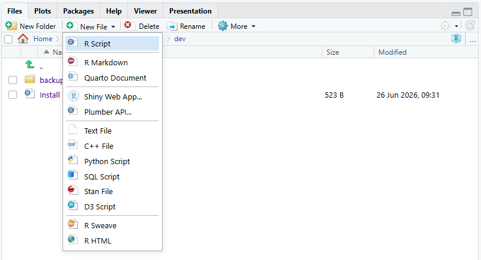
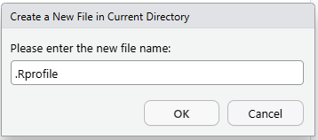
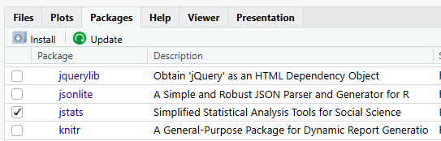

```{r}
#| label: obx-setup
#| include: false

# ---------------------------------------------------------------------------
# PANE FACSIMILES -- render scaffolding.
#
# This page sources pane_facsimile.R for two beats:
#
#   1. A Source-pane figure of the finished .Rprofile, beside its plain ```r
#      copy box (COPY-BOX-PRIMACY: the fence is the copy source; the
#      facsimile shows the file in place). A FACSIMILE rather than a
#      screenshot deliberately -- the page promises the file will grow (a
#      data-location line, an output-digits line), and each future addition
#      then re-renders from this chunk instead of forcing a re-shoot.
#      show_source() renders its code UNRUN.
#
#   2. A Console figure of the startup message a reader sees once the
#      .Rprofile is in place. This one RUNS library(jstats) live (the same
#      first-attach fidelity as quickstart.qmd: jstats must be installed in
#      the render environment, must NOT be pre-attached, and the
#      noninteractive gate below must be open -- requires jstats >= 0.9.103).
#      echo = FALSE (S192) drops the "> " prompt line, because at session
#      start the message appears WITHOUT the reader typing anything.
#
# Everything else on this page is a static screenshot or a plain code fence.
# ---------------------------------------------------------------------------

options(width = 80)          # match a default 80-column console

# .onAttach() is silent in a non-interactive session unless this gate is
# opened for the render; with it open, the facsimile shows the REAL, CURRENT
# startup message rather than a hard-coded copy that would go stale on every
# version bump. (Same mechanism as quickstart.qmd; see zzz.R.)
options(jstats.attach.noninteractive = TRUE)

source("pane_facsimile.R")   # defines .obx (dot-named)
```

## Loading jstats automatically

Once jstats is installed, you can have your Project load it for you every time it
opens — so you never type `library(jstats)` by hand. It's optional (typing the one
line at the start of a session works perfectly well), but it takes only a couple
of minutes to set up — and later on you can add other lines to the same file to
handle other start-of-session tasks, like loading the data you'll be working
with. This uses a small setup file called an **`.Rprofile`** (a file R reads
automatically when it starts).

The file lives in your Project folder, and the easiest place to create it is the
**Files** tab in the **lower-right pane**, which shows that folder's contents.
Click **New File** and choose **Text File**:

{width=500px fig-alt="The Files tab in RStudio's lower-right pane with its New File dropdown open, listing Text File among the file types."}

RStudio asks for the file name. Type `.Rprofile` — the leading dot included,
nothing after it — and click **OK**:

{width=358px fig-alt="RStudio's new-file dialog asking for a file name, with .Rprofile typed in."}

As long as you haven't changed the save location, this puts your new `.Rprofile`
in the right place — your Project folder, right next to the `.Rproj` file — and
opens it in the Source pane. (There are other ways to create a text file, but
this route is the most straightforward.)

::: {.callout-note collapse="true" title="Aside: started with an R Script instead?"}
If you chose **R Script** rather than Text File, RStudio adds a `.R` extension
when the file saves — so a script saved under the name `.Rprofile` ends up on
disk as `.Rprofile.R`, a name R never looks for, and nothing loads at startup.
The fix is a rename: in the **Files** tab, check the box beside the file, click
**Rename**, and remove the `.R` from the end. (Or check the box and click
**Delete**, then start again with a Text File.)
:::

Now copy and paste these lines into your new `.Rprofile`:

```r
# To reinstall jstats (new computer, or after updating R) see the install
# code at: jma61.github.io/jstats-guides/install-jstats.html
library(jstats)
```

Pasted in, the file looks like this:

```{r}
#| echo: false
#| results: asis
.obx$show_source(r"---(# To reinstall jstats (new computer, or after updating R) see the install
# code at: jma61.github.io/jstats-guides/install-jstats.html
library(jstats))---", name = ".Rprofile", dirty = FALSE)
```

The last line does the loading. The comment above it holds the address of the
install page, so the reinstall instructions are one glance away on a new
computer or after an R update.

Save — the disk icon at the top of the Source pane, or **Ctrl+S** (**Cmd+S** on a
Mac) — and check that the tab reads `.Rprofile`, nothing more. (Picked up a `.R`
on the end? The aside above has the fix.)

That's it — now, every time you start a new RStudio session in this Project,
jstats loads automatically. If you'd like to test it right away, restart R
(**Session menu, Restart R**).

You'll see it worked down in the Console: jstats announces itself with the same
startup message you first met in [jstats Quick Start](quickstart.qmd) — only this
time you didn't type anything to get it:

```{r}
#| echo: false
#| results: asis
.obx$show_console("library(jstats)", echo = FALSE)
```

The **Packages** tab shows it too: the checkbox beside jstats is ticked —
RStudio's sign that the package is loaded for this session:

{width=440px fig-alt="RStudio's Packages tab, showing the jstats entry with its checkbox ticked."}

Keep your `.Rprofile` to lightweight startup lines — loading a package, and later a setting or
two. Do **not** put an install command (an `install.packages("jstats", ...)` line)
in `.Rprofile`: because the file runs on every startup, an install line there tries
to reinstall each time and can send RStudio into a loop. Installing is a one-off you
run by hand; loading is the repeatable step that belongs in startup.

We're keeping this minimal for now. Later you'll add a line or two more — where
your data lives, and how many digits to show in output — but this is plenty to
start.

::: {.callout-note collapse="true" title="Going deeper (optional)"}
This `.Rprofile` lives inside your Project and applies only to this Project.
That's deliberate — it's self-contained and safe to edit. There's also a global,
all-Projects version, but it's better left until you're juggling several Projects
at once; the books cover it.
:::
