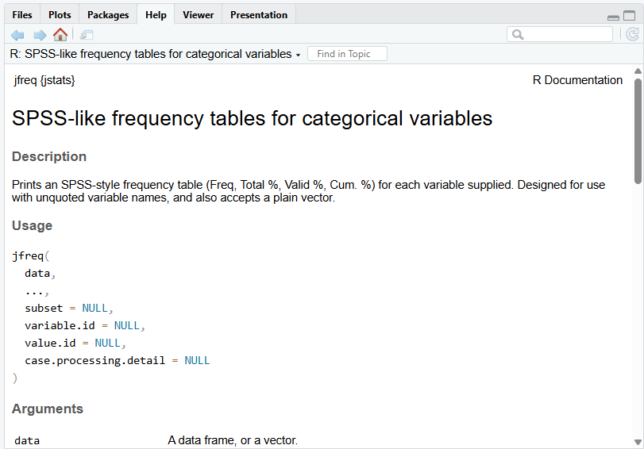

```{r}
#| label: obx-setup
#| include: false

# ---------------------------------------------------------------------------
# CONSOLE FACSIMILES -- render scaffolding (S187). Hidden (include: false).
#
# This page uses BOTH facsimile devices:
#   - .obx$show_console(fence = TRUE)  -> open, in-flow Console pane. Used for
#     the three blocks whose output carries the page's ARGUMENT (the first
#     library() call, the bare base R triple, and the jdesc table that answers
#     it). Collapsing those would hide the very thing being argued about.
#   - .obx$show_block(chrome = TRUE)   -> collapsed "What you should see" box.
#     Used from the first jfreq onward, where the output is the reader's own
#     result to CHECK rather than part of an argument.
#
# NOTE -- jstats is deliberately NOT pre-loaded here. data.qmd's setup calls
# suppressPackageStartupMessages(library(jstats)) to attach once for the page;
# doing that here would make the page's own first block a no-op -- R prints the
# startup message on FIRST attach only, so a pre-attached package would leave
# the open Console facsimile showing a bare "> library(jstats)" and nothing
# beneath it. The block's whole point is that message, so block 1's library()
# call must be the genuine first attach. pane_facsimile.R is pure base R and
# needs no package, so nothing here depends on an early load.
#
# joutput()/joptions() are likewise left alone: a first-time reader runs on
# package defaults, so a virgin render session is exactly the right fidelity.
# The page writes nothing to disk, so it needs no clean-slate or teardown.
# ---------------------------------------------------------------------------

options(width = 80)   # match a default 80-column console for table alignment

# Block 1 renders library(jstats) into a Console facsimile, and the startup
# message it shows is the POINT of that block. But .onAttach() returns early in
# a non-interactive session (R CMD check, knitr, Quarto), so a plain render
# would print nothing. This option opens that gate for the render only, so the
# facsimile shows the REAL, CURRENT message (version number and all) rather
# than a hard-coded copy that would go stale on every version bump. Requires
# jstats >= 0.9.103. (S187; see zzz.R.)
options(jstats.attach.noninteractive = TRUE)

# Defensive only: the ?jfreq / ?jstats blocks are PLAIN fences and never run.
# Should one ever be converted to a facsimile, help() would start R's httpd
# help server and call browseURL(), popping a browser tab on every render.
# A no-op browser swallows that. (Same guard as data.qmd; see S186.)
options(browser = function(url) invisible(NULL))

source("pane_facsimile.R")   # defines .obx (dot-named -> survives rm(list = ls()))
```

## jstats Quick Start

This is where you put jstats to work. We'll take a quick tour of the package on a
practice dataset that comes built in — describing and counting variables, screening a
whole dataset in one pass, and finishing with a basic linear regression, the workhorse
of the social sciences.

People come to jstats from very different starting points. Some readers have years of
statistical experience and want to see what the package offers; others are early in a
first statistics course. This tour is written for both: every command is easy to
follow whatever your background, and if some of the output toward the end — the
regression especially — involves statistics you haven't been taught yet, that's fine
and expected. The goal here isn't to teach statistics; it's to get you working with
the package.

Every command below sits in a copy-and-paste box. If you're following along with the
companion video, you might keep this page open beside it so the commands stay close at
hand — and whether you type or paste, enter each one exactly as it appears: R is
case-sensitive, so capitalization has to match.

## Before you start

Two reminders from the earlier pages before we begin.

**Open RStudio by opening your Project** — the one you created for this practice work.
From inside RStudio, that's **File → Open Project**; or, in your computer's file
manager (**File Explorer** on Windows, **Finder** on a Mac), double-click the `.Rproj`
file inside the Project's folder. Working inside a Project keeps your files, your data,
and your work together in one place. And remember which program you're opening:
**RStudio**, the window you work in — not the plain **R** application, which is only the
engine underneath.

**Load jstats for this session.** R makes you load an installed package in each new
session before you can use it. Installing jstats was the one-time step, and that's
done; loading it is the every-session step, because a fresh session starts with nothing
loaded. So the first command of the day is the `library()` command you met when you
installed the package.

## A script file, and loading jstats

We'll give our commands a proper home. Rather than typing into the Console, we'll work
in a **script** — a file where everything you do can be saved, ready to re-run, correct,
or build on later. (You saw the division of labor in the orientation: the Console is for
quick one-offs; a script is for work you keep.) Open one with **File → New File → R
Script**; it appears in the Source pane, top-left.

The first line to type is the library command. Run it the way you practiced — cursor
anywhere on the line, then **Ctrl+Enter** (**Cmd+Enter** on a Mac), or the **Run** button
at the top of the pane:

```{r}
#| echo: false
#| results: asis
.obx$show_console("library(jstats)", fence = TRUE)
```

Down in the Console, jstats answers with a short startup message, and that message
confirms the package is loaded for this session. (Typing one library line per session is
no great burden — but if you'd rather have jstats load itself automatically whenever
RStudio opens, [Loading jstats automatically](loading-jstats-automatically.qmd) shows you
how.)

::: {.callout-note collapse="true" title="If you see a warning"}
Alongside the startup message, R may also print a **warning** — most often one saying the
package *was built under* a newer version of R than the one you're running. Nothing has
gone wrong. jstats is loaded and working.

It's worth knowing the difference between the two things R can say to you, because you'll
meet both. An **error** means R *stopped*: the command did not run, and nothing was
produced. A **warning** means the command *did* run, and R is telling you something about
it afterward. So a warning is never cause for alarm — but it isn't something to ignore on
principle either. Read it. Some warnings matter a great deal; this one doesn't.

This one simply reflects that the copy of jstats you downloaded was built on a slightly
newer version of R than the one on your computer. It's harmless, and it will reappear each
time you load the package until your R catches up. If you'd rather not see it, install the
current version of R — [Install R and RStudio](install-r-and-rstudio.qmd) walks through
it.
:::

## Why jstats — a quick contrast

Now, with jstats loaded, here's what it's for. The package ships with a practice
dataset named `community`, and we'll use it for the whole tour (more on it shortly).
Suppose you want to describe the ages of the people in the data — the average, how
spread out they are, and so on. Base R — R as it comes, before any packages — can do
this, and one common way takes three separate commands. You don't need to learn these;
we're running them only for the comparison. Leaving a blank line between commands is
optional — R ignores blank lines entirely, so you can use them to space a script for
readability, or not:

```{r}
#| echo: false
#| results: asis
.obx$show_console(r"---(mean(community$Age)

sd(community$Age)

range(community$Age))---", fence = TRUE)
```

You can run these one line at a time, or select all three and run them together — either
way, R returns three answers, one beneath the other. Each line opens with the `[1]` you
met in the orientation: that's R numbering its output, marking the position of the first
value on the line — it isn't part of the result. Beyond that, the answers are correct but
bare: unlabeled numbers, one command per statistic. Describing five variables this way
would mean fifteen lines. And some basic facts are still missing — how many respondents
there are, and whether any ages are missing. Here's the same job in jstats, with a
function called `jdesc` (short for *descriptives*):

```{r}
#| echo: false
#| results: asis
.obx$show_console("jdesc(community, Age)", fence = TRUE)
```

One command, one table — the total number of cases, how many are non-missing, the
minimum and maximum, the mean, and the standard deviation, together and labeled, laid
out the way you'd expect from commercial statistical software like SPSS or Stata. That,
in a nutshell, is what jstats is for: taking the everyday work of data analysis and
making it simple and readable. The rest of this tour builds on that idea.

## Meet `community`

That practice dataset, **`community`**, holds 103 simulated community-survey respondents,
each with a handful of measures: income, education, age, a wellbeing score, a few yes/no
items, a region of residence, and a five-item attitude scale. It's available the moment
you load jstats — no file to open, nothing to import — which is what lets these examples,
and the package's help-page examples, run without any setup. Bringing in and working with
data of your own is covered in [Loading, Saving, Converting Data](data.qmd).

## Counting a categorical variable with `jfreq`

Next, the same pattern on a different job: counting the categories of a categorical
variable. And it *is* the same pattern you've already seen — choose the function, then
give it your input inside the parentheses.

The jstats functions share a first letter, too: every one begins with **`j`**. That's
deliberate — the `j` sets the package's functions apart at a glance from base R's and
from other packages' — and it has a practical payoff. In RStudio, type `j` and press the
**Tab** key, and the auto-complete list gathers the jstats functions together for you.
(Not everything in that list is jstats — base R has a few functions of its own that begin
with `j` — but most of what you'll see belongs to the package.)

This time the function is `jfreq` (short for *frequencies*), and the question is how our
respondents are distributed across regions:

```{r}
#| echo: false
#| results: asis
.obx$show_block("jfreq(community, Region)", chrome = TRUE)
```

Inside the parentheses, `jfreq` takes two things in order: the dataset (`community`) and
the variable to count (`Region`). It prints a frequency table — the number of respondents
in each region, alongside the percentages. (Note the capital **R** in `Region`:
capitalization has to match, and to R a lowercase `region` would be a different name
entirely.)

You'll also see one more mark throughout these examples, from the orientation: the `#`. A
`#` tells R to ignore the rest of the line — everything after it is a **comment**, a
plain-language note for the human reader:

```r
jfreq(community, Region)   # counts by region
```

Run that version and the table is identical — R carried out the command and passed
straight over the note. Comments cost nothing, and they let your future self, and anyone
else reading your script, see at a glance what each line is for.

## The examples just run

Every function comes with a help page, and each jstats help page ends with worked
**examples** you can run yourself. Let's open the one for the function we just used. A
quick lookup like this is a natural job for the Console — the script is for work you
keep, and this is a one-off — so down in the Console, type:

```r
?jfreq
```

{width=620px fig-alt="RStudio's Help pane, in the lower-right, showing the jfreq help page: the tab bar with Help selected, the page title, the Description, and the start of the Usage section."}

A `?` followed by a function's name opens that function's help page in the bottom-right
pane. Scroll to the bottom and you'll find the **Examples** section: copy one, paste it
into the Console, and it runs immediately — because the data it uses are already loaded.
No file to open, no path to set.

A fair word on this, especially if you're coming from commercial statistical software:
runnable help examples aren't unique to R. Stata and SAS ship practice data too. What's
genuinely worth knowing is this. First, **most of the package's examples are run
automatically** whenever it's built and checked, so they don't quietly fall out of date.
Second, there's truly **zero setup**: `community` is simply *there*. Third, **one source**
produces all three — the function, its help page, and its runnable example all come from
the same place, so they can't drift apart. The practical effect: when you're learning a
new function, you can always try it instantly on data that are already in front of you.

## Getting help on any function

You just used `?jfreq` to open a help page. That works for every jstats function — and
across R generally: type `?` and the function's name. There's also a shortcut: in your
script, click a function's name and press **F1** (Windows) or **Fn+F1** (Mac). Either way
the help page opens in the bottom-right pane, with a description, the available options,
and worked examples you can run (they sit at the bottom, so scroll down).

And one more help page is worth knowing about — the package's own. Put the package name
after the question mark this time:

```r
?jstats
```

That opens the overall jstats help page. At the top is a description of the package —
what it does and who it's for. Below that, every current function is listed, grouped by
purpose, each name a clickable link straight to that function's own page. Further down,
the page describes the package's workflow conventions — how its functions are meant to
string together, from the start of a session through to the finished results. When you
can't recall a function's name, or you want the full picture of what's available, this is
the page to open.

## What a data frame is

A quick reminder of a term from the [RStudio Orientation](rstudio-orientation.qmd),
because you'll meet it everywhere in R: a table of data like `community` is a **data
frame** — cases in the rows, variables in the columns, held in memory and ready to work
on. And recall the practical side: when you work with `community`, R is working on a copy
held in memory — the one listed in your Environment pane — not the file on disk, so you
can explore and change it freely, and nothing is written to disk until you deliberately
save.

::: {.callout-tip collapse="true" title="Coming from SPSS, Stata, or SAS?"}
If you're arriving from SPSS or Stata, this is a genuine difference worth a pause. There,
the dataset open in front of you is the file itself, and saving writes your changes
straight back to it. R works on the in-memory copy instead, and leaves your original file
untouched until you explicitly save. (SAS sits closer to R here — a DATA step writes a new
dataset rather than editing an open one — so the in-memory copy will feel less foreign;
what still needs watching is that in R nothing reaches the disk until you say so.) What you
gain is the freedom to experiment without putting your data at risk; what it asks of you is
remembering that nothing reaches the disk until you save it.
:::

## Set a default dataset

You named `community` explicitly in your `jfreq` call. If you'll work with one dataset for
a while, you can set it as the default and stop repeating its name. Do that with `juse`
(short for *use*):

```{r}
#| echo: false
#| results: asis
.obx$show_block("juse(community)", chrome = TRUE)
```

Now rerun the frequency table without naming the dataset:

```{r}
#| echo: false
#| results: asis
.obx$show_block("jfreq(Region)", chrome = TRUE)
```

Same result — jstats fills in `community` for you. And `juse` changes nothing about the
datasets themselves; it only marks which one jstats should reach for when you don't say
otherwise. (Your Environment can hold several datasets at once, each addressed by name,
and you can switch the default whenever you like.)

## Describe the numeric variables

For numeric variables like age or income, you usually want the mean, the standard
deviation, and the like rather than a full frequency table — and that's `jdesc` again.
Because `community` is now the default, we name just the variables:

```{r}
#| echo: false
#| results: asis
.obx$show_block("jdesc(Age, WellbeingScore, Income)", chrome = TRUE)
```

It's the same table layout you saw at the start of the tour, now with one row per
variable — three variables summarized in a single, readable table.

## Screen the whole dataset at once

Before any serious analysis, it's good practice to survey the whole dataset — its ranges,
possible outliers, skewed distributions, missing values, and what *kind* each variable
seems to be. `jscreen` (short for *screen*) folds that whole first look into one call:

```{r}
#| echo: false
#| results: asis
.obx$show_block("jscreen()", chrome = TRUE)
```

With the `juse` default set, a bare `jscreen()` screens every variable in `community` and
gives you a fast, organized read on the data's health. We're keeping this light here —
jscreen can report a good deal more, and its help page and the books treat it in full
depth — but even the quick look is a habit worth building: analysis goes better when you
know what your data are before you start.

## Your first analysis: a regression

The last stop is a basic linear regression, the workhorse of the social sciences. If
you've run regressions for years, watch how little typing this takes — and notice that
the printed results go well beyond base R's. If you're meeting regression for the first
time, here's the one-sentence version: a regression asks whether one variable tends to
rise or fall as another changes, and puts a number both on the strength of that
relationship and on how confidently it can be told apart from chance. We'll ask whether
age predicts wellbeing among our respondents.

The function is `jlm` (short for *linear model*, the formal name for this kind of
analysis). If you're an experienced R user, you'll recognize it as a close cousin of base
R's own `lm` — the resemblance is deliberate: jstats stays near base R wherever it can, so
what you practice here carries over. Here's the command in its simplest form:

```{r}
#| echo: false
#| results: asis
.obx$show_block("jlm(WellbeingScore ~ Age)", chrome = TRUE)
```

::: {.callout-tip collapse="true" title="If you're new to statistics"}
A regression asks a simple question: as one thing changes, does another tend to change
along with it, and by how much? Here we're asking whether wellbeing tends to rise (or
fall) as age goes up. The output puts a number on that tendency, and on how confident we
can be that it's a real pattern rather than chance.
:::

One new piece of notation sits in the middle: the wavy character, called a **tilde**. The
tilde is how R writes a model, and the rule is simple — the **outcome** (the variable you
want to explain, here the wellbeing score) sits on its left, and the **predictor** (the
variable doing the explaining, here age) sits on its right. So read `WellbeingScore ~ Age`
as "wellbeing, explained by age." (We didn't name the dataset: `juse(community)` is still
in effect, and jstats notes which data frame it used at the top of the output.)

Now here's a second way to run the same analysis — one you'll see everywhere in R:

```{r}
#| echo: false
#| results: asis
.obx$show_block("Results <- jlm(WellbeingScore ~ Age)", chrome = TRUE, env = TRUE)
```

That arrow on the left — typed as a less-than sign followed by a hyphen — is R's
**assignment operator**. It stores whatever is produced on its right under the name on its
left: here, the complete results of the regression, saved under the name `Results`. That
name is our own choice, by the way — there's nothing special about the word `Results`; we
could have called it almost anything. In base R this is how results are generally kept,
and you'll see the arrow constantly. In jstats it's optional: you use it when you want to
keep an analysis's results for later work — say, passing `Results` to another function
that formats them into a polished table for a report or article — without running the
regression again.

And notice what happened in the Console when that second form ran: the full results
printed again — while `Results` itself appeared in the **Environment** pane, upper right.
That's the default behavior of every jstats analysis function — it prints its results
*and* hands you the stored copy, so the arrow costs you nothing.

"Default" is worth dwelling on, because it points to something useful as you go further:
most jstats functions accept **options**. Open any function's help page and you'll find
them — options that adjust what the function does, and options that adjust what appears in
the output (the number of digits shown, how variable and value labels appear, which
informational notes print, and more). You can set these per command, or once for the whole
session through two functions, `joptions` and `joutput`. We won't tour them here; just know
the controls are there, and the help pages show the way.

## Read the output

Take a moment to look over what jstats printed — in your own Console, or in the box
above. If regression is familiar territory,
you'll find the essentials of a standard analysis laid out in this single output — the
coefficients, their significance tests, the model-fit statistics — with nothing further to
request or assemble. If regression is new to you, don't try to decode the table today:
learning what each number means is the business of an introductory statistics course, and
of the books that accompany this package, one careful piece at a time. For now the point
is simpler — one short command produced a complete, readable analysis, and a saved copy
sits in `Results` whenever you're ready to use it.

## What you've done

In one short script, you described a variable, counted a categorical one, summarized
several variables at once, screened an entire dataset, and ran a linear regression. Each
task had its own function, but every function took the **same form** — and once `juse` set
the default, none of them needed the dataset retyped, or the dollar-sign construction
(`community$Age`) you saw in the base R lines at the start. At the same time, that form
stays close enough to base R that what you've practiced transfers — to base R itself, and
to other packages' functions, whenever your work calls for them.

Your script can be saved, too, so today's commands are there to reopen and build on in a
future session. Saving script files — and where they live inside your Project — is covered
in a later guide.

::: {.callout-note title="Where to go next"}
The natural next step is bringing in data of your own — your own files, and the realities
that come with them, like respondents who declined to answer a question (income, in
`community`, is one such variable). Handling missing values like those is exactly what the
next part is about: [Loading, Saving, Converting Data](data.qmd).
:::


