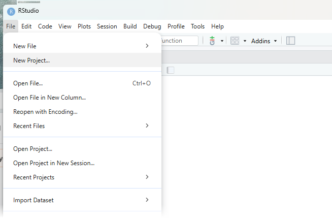
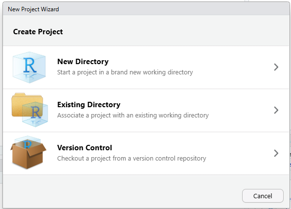
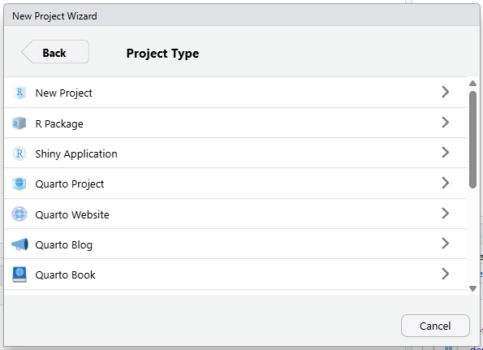
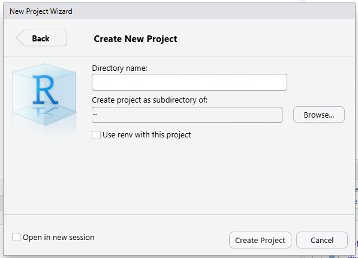
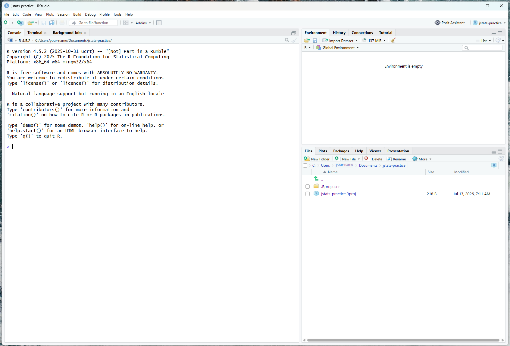
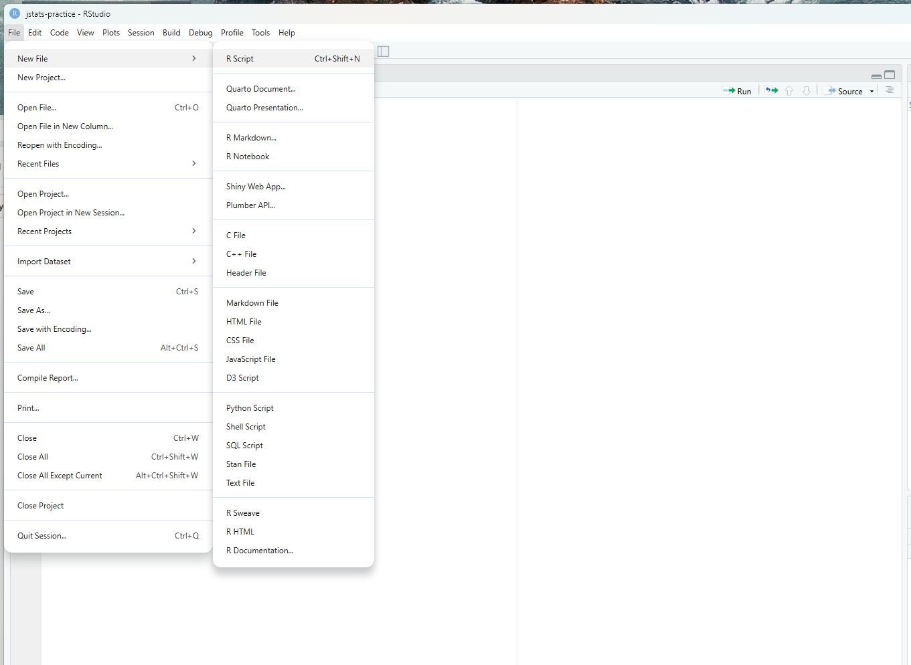
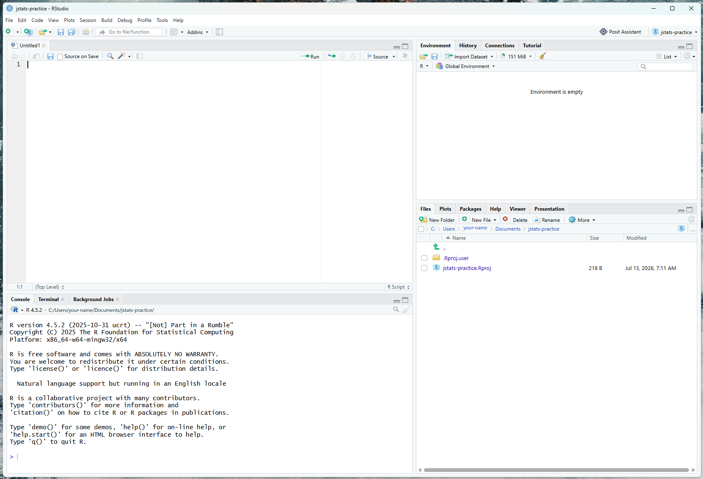

```{r}
#| label: obx-setup
#| include: false

# ---------------------------------------------------------------------------
# PANE FACSIMILES -- render scaffolding (S186).
#
# This is a SPINE page, not a Going-further page: no numbered blocks, no
# follow-along script, no teardown, and no "What you should see" boxes. It
# sources pane_facsimile.R for exactly one beat -- the source-vs-console
# comparison in "The Source pane" -- where the facsimiles are used as LAYOUT
# FIGURES (they teach WHERE code lives), not as expected-output boxes. Hence
# .obx$show_source() / .obx$show_console(), which emit bare captioned panes,
# rather than .obx$show_block(), which wraps its pane in a collapsed callout.
#
# pane_facsimile.R has no package dependencies -- important here, since this
# page runs BEFORE the reader has installed jstats.
#
# Everything else on this page is a static screenshot or a plain code fence.
# ---------------------------------------------------------------------------

options(width = 80)          # match a default 80-column console
source("pane_facsimile.R")   # defines .obx (dot-named)
```

## RStudio Orientation

Before installing the package, it's worth a few minutes getting comfortable with
RStudio itself — where things are, and how your data looks once it's loaded. If
you already work in RStudio day to day, you can skim this and move on to
[Install jstats](install-jstats.qmd).

## Start a Project

Before installing the package or loading any data, create an RStudio **Project**.

Without a Project, R needs to be told where your files live (its "working
directory"), and that quickly drags in folder paths, the difference between `\`
and `/`, and the fact that Windows and Mac write paths differently. A Project
sidesteps all of it: it ties a folder, your data, and your work together, so R
always knows where it is.

To create one, choose **File → New Project…** from the menus.

{width=500px fig-alt="RStudio's File menu open, with New Project… highlighted."}

RStudio now asks two quick questions, in two windows. Take the **first option**
each time — **New Directory**, then **New Project**. Neither window needs a real
decision from you, so we won't dwell on them; if you'd rather see them before you
click, open the box below.

::: {.callout-note collapse="true" title="Click-by-click"}
**First window — Create Project.** Choose **New Directory**, the top option.

{width=460px fig-alt="RStudio's Create Project dialog, offering New Directory, Existing Directory, and Version Control. New Directory is the first option."}

**Second window — Project Type.** Choose **New Project**, again the top option.
(The rest of this list is for building R packages, Shiny apps, and other things
you won't need here.)

{width=460px fig-alt="RStudio's Project Type dialog, a list beginning with New Project, followed by R Package, Shiny Application, and other project types."}

RStudio then shows you the naming window — the one pictured back in the main
text, just below this box. Carry on from there.
:::

The third window is the one that needs you:

{width=460px fig-alt="RStudio's New Project dialog: a directory name field, a field for where the project should live, and a checkbox for renv."}

Name the directory **`jstats-practice`** — later pages on this site assume that
name, so it's worth using it as it stands. Then choose where it should live: a
folder on your computer itself is a safer home than a cloud-synced one like
OneDrive, whose syncing can quietly interfere with R's files. Leave **Use renv
with this project** unticked (renv keeps a per-project record of package
versions — genuinely useful on large projects, and unnecessary here). Then click
**Create Project**, and RStudio opens your new Project.

From now on, there are two ways to reopen this Project. From inside RStudio, choose
**File → Open Project**. Or, in your computer's file manager — **File Explorer** on
Windows, **Finder** on a Mac — open the Project folder and double-click its `.Rproj`
file (the small file RStudio created there), which launches straight into RStudio. That
one habit — always work inside a Project — saves more beginner headaches than any other.

## The RStudio panes

With your Project open, RStudio shows **three panes** to begin with. A fourth — the **Source pane**, in the top-left — doesn't appear until the first time you open a script or view a dataset, so we'll meet it last. We'll take the other three in the order you'll actually reach for them, starting on the left.

{width=100% fig-alt="The RStudio window showing three panes: a tall Console occupying the full left side, the Environment pane top-right, and the Files/Plots/Packages/Help pane bottom-right."}

### The Console — where you type and run code

The tall pane down the **left** side is the **Console**. (With only three panes open it fills the whole left side; the moment the Source pane appears above it, the Console settles into the bottom-left.) This is where you **type — or paste — a command, press Enter, and R runs it**, printing the result just below.

Let's make that real. Click anywhere in the Console, type a sum, and press Enter — and R answers straight back:

```{r}
#| echo: false
#| results: asis
.obx$show_console("2 + 2", fence = TRUE)
```

The Console is a calculator that talks back. Now try a **function** — a named command you give some input to, inside parentheses. This one finds a square root:

```{r}
#| echo: false
#| results: asis
.obx$show_console("sqrt(144)", fence = TRUE)
```

(And yes, `sqrt` is plain R — you're already learning the real thing. More on what a function actually is in a moment, once we've used a second one.)

You'll also see **Terminal** and **Background Jobs** tabs sharing this pane with the Console. They're for more advanced use — the Terminal is a direct line to your computer's own command prompt — and you can ignore them for now.

### The Environment — what you've loaded

The Console also runs commands that *create* things and keep them around. Let's load a dataset, so the **Environment** has something to show. R ships with several built-in datasets for practice; one is `mtcars` (data on some classic car models). Copy it into a name of your own using R's **assignment operator**, `<-`, which means "put what's on the right into the name on the left." Type this in the Console and press Enter — and watch the **top-right** of the screen as you do:

```{r}
#| echo: false
#| results: asis
.obx$show_console("cars <- mtcars", fence = TRUE, env = TRUE, env_mark = "cars",
  note = "Notice the Console prints nothing back. Creating an object is a silent act -- the result doesn't appear below your line, it appears in the <strong>Environment</strong>, up in the top-right.")
```

Up in the top-right is the **Environment pane** — named for its main tab, **Environment**, open by default — and your new `cars` has just appeared there, described as *32 obs. of 11 variables*. That's its name and size, not the data themselves; the Environment lists what you've loaded, it isn't a window onto the data.

What `cars` actually is, in R's terms, is a **data frame**: a table held in memory, with cases down the rows and variables across the columns. Two words are worth keeping apart. A **dataset** is the data at rest — a built-in like `mtcars`, or, later on, a data file on your disk. A **data frame** is the working copy R loads into memory for you to work on. So `cars` is a data frame — a copy of the built-in `mtcars`. That distinction has a practical side worth knowing from the start: when you change a data frame — recode a variable, say, or drop a few rows — R changes only the working copy in memory and leaves the original untouched, and your changes live in that working copy alone until you deliberately save them. With a built-in like `cars` there's no file of your own in play; but once you're working with data you've loaded from your own files, this is the thing to hold onto — nothing is written back to your file on disk until you choose to save. You're not limited to one, either — load or create several data frames and they all list here by name, and you pick which to work on simply by using its name.

### Output / Files / Plots / Help — the bottom-right pane

The **bottom-right** pane gathers everyday tools as tabs: **Files** (the contents of your Project folder), **Plots** (any charts you make show up here), **Packages** (every package installed on your computer is listed here — jstats will appear once you install it, and ticking a package's checkbox loads it, the same job as `library()`), and **Help** (R's built-in documentation). RStudio's own name for it is the **Output** pane. You'll dip into these constantly without thinking about them much.

### The Source pane — where you write and keep code

Now the fourth pane. Open a new script — **File → New File → R Script** (or press **Ctrl+Shift+N**, or **Cmd+Shift+N** on a Mac).

{width=100% fig-alt="RStudio's File menu open, with New File selected and R Script highlighted in the submenu that opens beside it."}

The **Source pane** opens in the **top-left**, holding an empty, untitled script — and the Console, which until now filled the whole left side, settles into the **bottom-left** to make room. That's the four-pane layout you'll work in from here on.

{width=100% fig-alt="The RStudio window showing four panes: an empty untitled script in the Source pane top-left, the Console beneath it bottom-left, the Environment top-right, and the Output pane bottom-right."}

That's the one real difference between the two left-hand panes: **the Console is for doing, the script is for keeping.** Anything you type in the Console runs and then scrolls away — ideal for a quick, one-off job like a fast calculation. Code you'll want to re-run, revise, and share goes in a **script**: a plain text file (with a `.R` ending) that you save. Typing in a script doesn't run anything on its own; when you're ready, you send a line down to the Console to run it.

Which is easier to see than to describe. Click into your new script and type a line you've already met:

```{r}
#| echo: false
#| results: asis
.obx$show_source("sqrt(144)")
```

And notice what happens: **nothing.** No `[1] 12`, no answer — just the line, sitting there. The script is a place to *write* code, and writing is all you've done. R hasn't been asked to do anything yet.

So ask it. Put the cursor anywhere on the line and press **Ctrl+Enter** (**Cmd+Enter** on a Mac), or click **Run** at the top of the pane. The line is sent down to the Console, and *now* R answers:

```{r}
#| echo: false
#| results: asis
.obx$show_console("sqrt(144)")
```

Same line, same answer as when you typed it into the Console earlier. The difference isn't in what R does — it's in where the code *lives*. Run it from the Console and it's gone as soon as it scrolls away; keep it in a script and you can run it again tomorrow, change one number and re-run it, or send the whole thing to a colleague. Nearly all your real work will be written in the script and *run* in the Console, and that is the habit these guides will keep building.

Stay in the script for the next one. On a new line beneath `sqrt(144)`, type — or paste — the line below, and run it the same way:

```r
View(iris)
```

A small thing that catches beginners: RStudio runs the *whole line* the cursor is sitting on, but if you *highlight* text it runs exactly — and only — what you've highlighted. So either leave the cursor on the line, or select the *entire* command; just don't run with only *part* of a line highlighted, or R will try to run that fragment on its own, which usually fails. (R is pickier about this than many other applications.)

`iris` is another built-in dataset (measurements of flowers); being built in, it's available by its own name without copying first. Note the capital **V** — `View` is one of a handful of base-R functions that breaks the usual all-lowercase habit, so `view(iris)` won't work. That's a glimpse of a rule worth learning early: **R is case-sensitive.** `Income` and `income` are two different names to it, and a stray capital is one of the most common reasons something "doesn't work." (jstats keeps its own functions lowercase, in step with the base-R majority.)

Running the line opens a grid in the Source pane — a new tab alongside your script — with rows of flowers down the side and variables across the top. (Clicking a data frame's name in the Environment opens the same read-only grid; `View()` just does it from code.) Notice one column, `Species`, holds group names — setosa, versicolor, virginica — instead of numbers: your first glimpse of a **categorical variable**, a column that sorts cases into groups. You'll meet these properly later.

There's one more idea worth pinning down before we move on, because nearly everything in R rests on it: the **function**. You've now used two — `sqrt()` and `View()` — and they share a shape: a function has a name, and you give it its input inside the parentheses that follow. `sqrt(144)` hands `144` to `sqrt` and gets `12` back; `View(iris)` hands `iris` to `View` and opens a data grid. That pattern — pick the function for the job, put your input in the parentheses, take the result — is how nearly all of R works. **jstats, which you'll install next, is simply a collection of functions in this same form**, named and tidied for the things social scientists do most. Once `something(input)` reads naturally to you, most R code does too.

You'll meet `mtcars` and `iris` again and again in R's help pages and other packages' examples — now you know what they are, so they won't catch you off guard. jstats brings its own example dataset too, `community`, which becomes available by name once you install and load the package; we'll use it from the Quick Start onward.

::: {.callout-tip collapse="true" title="Coming from SPSS, Stata, or SAS?"}
A rough map if you've mostly worked in commercial statistical software. The **Console** is like the **output/results window** where results appear (SPSS's output viewer, Stata's Results window, SAS's Log and Output), and the **Plots** tab is where charts show up. The closest thing to a **data view** — SPSS's **Data View**, Stata's **Data Browser**, SAS's table viewer — is the read-only grid that opens when you click a data frame in the Environment, or run `View()`; but the **Environment** pane itself is *not* that grid: it only lists what's loaded, by name and size. The **Source** pane is essentially the editor you already know under another name — the **SPSS syntax editor**, the **Stata do-file editor**, or the **SAS program editor** — a place to write commands, save them, and run them. If you write Stata or SAS code it'll feel almost identical; if you've mostly clicked through SPSS menus, the syntax editor is the SPSS feature it most resembles, and the one habit most worth building.

One deeper difference in style: those tools are built around **commands** or **procedures** — SPSS's `FREQUENCIES`, SAS's `PROC MEANS`, a Stata command, each followed by its options — whereas R is built around **functions** of the form `name(input)`. Getting comfortable with that single, consistent shape (which the next pages lean on heavily) is the main adjustment.
:::

## Leaving notes in your code — the `#` symbol

One small thing you'll see throughout the examples on this site, and in your own scripts before long. When R meets a `#` on a line, it ignores the `#` and everything after it, to the end of that line. That space is for **you**, not R — somewhere to leave a plain-language note about what a line does:

```r
sqrt(144)    # find a square root
```

R runs the `sqrt(144)` part and pays no attention to the words after the `#`. A line that *begins* with `#` is all note and does nothing when run — purely a label for whoever reads the script later, including a future you who's forgotten the details. Notes like these are how a script stays readable, and you'll see them used throughout the code on these pages to explain each step as it happens.

## Start each session with a clean slate

One quick setting is worth changing now. By default, when you quit RStudio it
offers to save everything currently loaded — your whole Environment — and reload
it next time. That sounds convenient, but it causes more confusion than it saves:
old objects from a previous session linger, and you can't easily tell what you
meant to keep versus what's just left over. It's a classic source of "why is this
still here?" puzzlement.

The cleaner habit is to start every session empty and rebuild what you need by
re-running your script — which is the dependable record of your work anyway. To
set that up, go to **Tools → Global Options → General**, then:

- uncheck **Restore .RData into workspace at startup**, and
- set **Save workspace to .RData on exit** to **Never**.

Now each time you open RStudio you start fresh, and your script — not whatever
happened to be in memory last time — is the source of truth.

---

With RStudio mapped out, the next page adds the jstats package itself.

