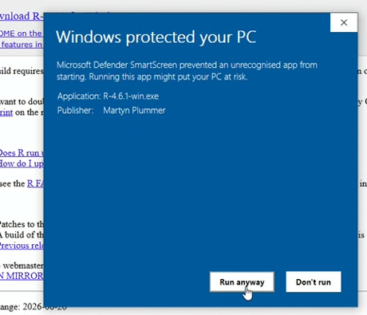
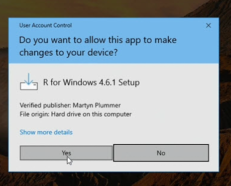

## Troubleshooting

Most problems during setup and early use are one of a handful of things. Find the
one that matches yours below. This page grows over time.

## Security warnings when downloading or installing

Installing R or RStudio for the first time can bring up a warning or two — a browser
prompt, a blue "Windows protected your PC" box, or a request for a password on a work
machine. This is normal for brand-new software from a source your computer hasn't seen
you use before; none of it means anything is wrong. Open the box that matches your
situation:

::: {.callout-warning collapse="true" title="On your own computer"}
When an installer finishes downloading, your browser may ask whether to **keep** the
file. Keep it — it's the installer you just requested.

Running the R installer, Windows may show a blue **SmartScreen** box offering, at
first, only a **Don't run** button. This is reputation-based, not a virus alert: it
appears because the file is newly released and too few people have downloaded it yet
for Windows to recognize it — not because anything is wrong with it. Click **More
info** and the box expands to show the app name and the publisher, along with a **Run
anyway** button. Only ever do this for installers you downloaded yourself from the
official sources — **cran.r-project.org** for R and **posit.co** for RStudio.

{width=460px fig-alt="Windows SmartScreen dialog, expanded via More info, showing the application name, the publisher, and a Run anyway button."}

On some machines — most often university- or employer-managed ones — the blue box
appears with **no More info link at all**: just a **Don't run** button and no way
past it. This usually happens when the installer is launched from the browser's
download list. The fix is to launch it from your **Downloads folder** instead: open
**File Explorer**, go to **Downloads**, and double-click the installer there. If the
box still offers no way through even from the Downloads folder, you're in the
managed-computer situation — see the next box down.

<!-- picture slot: images/security-smartscreen-no-more-info.png — the SmartScreen
dialog showing only a Don't run button, no More info link (screenshot when
available; add a figure line like the one above once the image is in images/). -->

Next, Windows asks permission to make changes to your computer — the **User Account
Control** box. It opens with **No** highlighted, so you have to click **Yes** on
purpose. Where it names a **verified publisher**, that's Windows confirming the
installer's digital signature checked out. (RStudio's permission box looks the same.
You generally won't see the SmartScreen step for RStudio, because its publisher is
already widely recognized.)

{width=460px fig-alt="Windows User Account Control dialog showing a verified publisher, with Yes and No buttons and No highlighted."}

One last thing, if you ever download an installer twice: the second copy comes back
with a number added to its name, like `R-4.6.1-win (1).exe`. Any copy is fine to run —
the `(1)` is just your browser avoiding a name clash, not a different or altered
program.
:::

::: {.callout-warning collapse="true" title="On a work or managed computer"}
On a university or workplace computer you may not be allowed to install software
yourself. What happens depends on how the machine is set up:

- The install is blocked, but the screen offers a path to **temporary administrator
  rights** — usually a prompt for your own credentials, sometimes followed by a box
  asking *why* you're installing. Both are routine; fill them in and carry on.
- There's no self-service path, in which case R and RStudio are requested through your
  **IT service desk**, a **software catalog**, or your **instructor**. The note below
  is written for whoever handles that request — you can point them straight to it.
:::

::: {#it-note .callout-warning collapse="true" title="A note for your IT department"}
*The rest of this entry is addressed to IT staff.*

A student or researcher has asked to install **R** and **RStudio Desktop**, the
standard open-source tools for statistical computing and the environment these guides
teach. This note summarizes their provenance to support a software-approval assessment.

- **Sources.** R is published by the R Foundation through CRAN
  (**cran.r-project.org**); RStudio Desktop comes from **Posit** (**posit.co** /
  **docs.posit.co**). Both are long-established and in wide academic and government use.
- **Signatures and integrity.** The R for Windows installer is code-signed — the User
  Account Control dialog shows a verified publisher — and it is downloaded over HTTPS
  from CRAN, which also publishes checksums for verifying the download. RStudio Desktop
  is signed by **Posit Software, PBC**.
- **Installing without administrator rights.** Administrator rights aren't strictly
  required. Run without them, the R for Windows installer installs into the user's own
  file area instead of Program Files (administrator rights are needed only for a
  system-wide install and the optional registry entries). RStudio Desktop is
  additionally offered as a **Windows `.zip` archive** that can be unpacked and run
  without the installer; current deployment guidance is on Posit's documentation site.
- **SmartScreen.** Microsoft SmartScreen may flag a freshly released version until it
  accumulates download reputation; this resets with each release and is not an
  indication of malware.
- Organizations operating under standards such as **ISO/IEC 27001** will route this
  through their software-approval process; the information above is provided to support
  that assessment.
:::

## Installing jstats

::: {.callout-warning collapse="true" title="A red WARNING says Rtools is required"}
During the install, the Console may print a red WARNING that **Rtools is required
to build R packages**. It looks alarming, but it's normal and not an error: it's
RStudio's general-purpose check for build tools, and it fires on almost any package
install on a Windows computer that doesn't have Rtools. jstats doesn't need Rtools
— it contains no compiled code and installs as a ready-made binary — so the install
completes and jstats runs fine. You can ignore the warning; there's nothing to fix.
:::

::: {.callout-warning collapse="true" title="The install seems half-done or broken"}
The simplest fix is to remove jstats and install it fresh:

```r
remove.packages("jstats")
install.packages("jstats",
  repos = c("https://jma61.r-universe.dev", "https://cloud.r-project.org"))
library(jstats)
```
:::

::: {.callout-warning collapse="true" title="The install fails on Windows: 'not writable', 'cannot create dir', or the message mentions OneDrive"}
On many Windows computers the **Documents** folder is synced by OneDrive — and by
default that is where R keeps its **package library** (the folder your installed
packages live in). OneDrive can lock files while it syncs, and an install that
runs into a lock fails part-way with messages like the ones above.

Fixes, from simplest to most durable:

1. **Pause OneDrive and retry.** Click the OneDrive cloud icon near the clock,
   choose **Pause syncing**, run the install line again, then resume syncing.
2. **Give R a package library outside the synced folder.** This one-time setup
   ends the problem for good. Create a plain folder directly on your drive, such
   as `C:\Rlibs`. Then create a plain text file named `.Renviron` in your
   Documents folder containing this single line:

   ```
   R_LIBS_USER=C:/Rlibs
   ```

   (Note the forward slash — that's how R writes paths.) Restart R and run the
   install line again; packages now install to the new folder, out of OneDrive's
   reach.

A related, rarer cause of the same errors: a Windows username containing accented
or non-English characters can break the library path in the same way. The same
fix applies — a package library at a simple location like `C:/Rlibs`.
:::

::: {.callout-warning collapse="true" title="The install asks for an administrator password, or a work network blocks the download"}
On managed work or lab computers, two things can stop the install: your account
may not be allowed to install software, or the network may block downloads from
sites it doesn't recognize. Neither is anything you did wrong — and the request
to your IT support is a small one. jstats installs as a **ready-made binary** (no
compilers or build tools are needed), fetched from the two addresses in the
install line: the r-universe repository (`jma61.r-universe.dev`) and an ordinary
CRAN mirror (`cloud.r-project.org`). Ask IT either to allow those two addresses
or to run the install line for you; either way it's a quick job for them.
:::

::: {.callout-warning collapse="true" title="Where did jstats install? / I updated, but I still see the old version"}
R keeps installed packages in a **library** — a folder on your computer — and
there can be more than one. On a fresh Windows setup, the install often lands
quietly in R's **system library** (inside Program Files) rather than in your
personal library, without asking. On its own that's harmless: jstats installs and
runs fine from there.

It only matters if you end up with **two copies in two libraries** — then an
update can land in one library while R keeps loading the older copy from the
other, and you appear stuck on the old version. To see which copy R is using,
and every library R searches:

```r
find.package("jstats")   # the folder of the copy R loads
.libPaths()              # every library R searches, in order
```

If those reveal a second, older copy, remove it from the library it sits in and
restart R:

```r
remove.packages("jstats", lib = "paste-the-other-library-path-here")
```

Then load jstats again and confirm the version with `packageVersion("jstats")`.
:::

## Starting RStudio and loading jstats

::: {.callout-warning collapse="true" title="RStudio hangs or loops every time it starts"}
This almost always means an **install command was put in your `.Rprofile`**. That
file runs *every time R starts*, so an install line tries to reinstall on every
startup and can loop. Your `.Rprofile` should only ever hold lightweight startup
lines like `library(jstats)` — never an install command. To recover: close RStudio,
open your Project folder in your computer's file manager, open the `.Rprofile` file
in a plain text editor (Notepad on Windows, TextEdit on Mac), delete the install
line, keeping the `library(jstats)` line (and its reminder comment, if your
`.Rprofile` has one), save, and reopen RStudio.
:::

::: {.callout-warning collapse="true" title="Loading jstats pauses for several seconds on a no-internet connection"}
While jstats is still in development it installs from an r-universe repository, and
each time it loads it briefly checks that repository for a newer version. The
package itself works fully
offline, but on a machine that is **connected to a network yet has no route to the
open internet** -- common on locked-down lab or server installations -- that check
has to time out before loading finishes, so `library(jstats)` can pause for a few
seconds.

To skip the check and load immediately, set this option *before* loading the
package:

```r
options(jstats.check_updates = FALSE)
library(jstats)
```

Putting the `options(...)` line above the `library(jstats)` line in your
`.Rprofile` makes it the default every session. On an ordinary internet
connection you can leave it out -- the check is fast there, and it's how you learn
an update is available.

This is specific to this pre-CRAN version. Once jstats reaches CRAN,
installing and updating happen the normal CRAN way, with no startup check of this
kind.
:::

::: {.callout-warning collapse="true" title="Error in library(jstats): there is no package called 'jstats'"}
This shows up two ways: you run `library(jstats)` in the Console and get this
error, or — if your `.Rprofile` loads jstats automatically — the same error
greets you every time RStudio starts. Either way, the usual cause is that **R
itself was updated**, and updating R starts a fresh, empty package library — so
jstats (along with any other packages you had installed) is no longer there.

The rule in plain words: R's version numbers have three parts, like 4.5.2. Only a
change to the **middle** number (4.5 → 4.6) starts a fresh package library; a
last-number update (4.5.1 → 4.5.2) changes nothing about your packages. And this
is about **R**, not RStudio — RStudio updates are always safe and never touch
your packages. R has no built-in update notifier, so updating R is a separate,
deliberate act; if you did it recently, this reinstall is the one follow-up
chore.

(Why `jupdate()` can't rescue you here: `jupdate()` is itself a jstats command,
and jstats isn't installed in the new library yet.)

The fix is the same install line as the first time — run it once and you're
back:

```r
install.packages("jstats",
  repos = c("https://jma61.r-universe.dev", "https://cloud.r-project.org"))
library(jstats)
```

Don't confuse this error with the harmless **warning** that jstats `was built
under R version 4.x.x` — that one just means the ready-made copy was built on a
slightly different R patch, needs no action, and clears on its own. This callout
is about the actual error where jstats can't be found at all.
:::

::: {.callout-warning collapse="true" title="could not find function 'jfreq' (or another jstats function)"}
jstats probably isn't loaded in this session. Run:

```r
library(jstats)
```

If it still isn't found, check spelling and capitalization — R is case-sensitive,
so `jfreq` and `jFreq` are different names.
:::

::: {.callout-warning collapse="true" title="object 'community' not found"}
The shipped datasets become available once the package is loaded. Run
`library(jstats)` first, then try again. (If you're working with your own data
instead, make sure you've loaded it — see
[Loading, Saving, Converting Data](data.qmd).)
:::


## Typing commands in the Console

::: {.callout-warning collapse="true" title="The Console shows a + and nothing runs"}
If you press Enter and the Console answers with a `+` instead of the usual `>`
prompt, R thinks your command isn't finished — nearly always a closing quotation
mark or a closing parenthesis is missing. Press the **Escape** key (Esc) to
cancel and get a fresh `>` prompt, then retype or re-paste the whole command.
(Typing more into the `+` line rarely ends well; Escape and a clean start is
quicker.)
:::

::: {.callout-warning collapse="true" title="Error: unexpected symbol (or unexpected ',' or ')')"}
These errors are R's way of saying the punctuation in a command doesn't add up —
most often a missing comma between two inputs, or a missing or extra parenthesis
or quotation mark. Compare your line character by character against the example
you copied it from; the difference is usually one small mark.

A reading tip that helps with R errors in general: in a long error message, the
most useful part usually comes **after the final colon** — start reading there,
then work backward only if you need to.
:::


